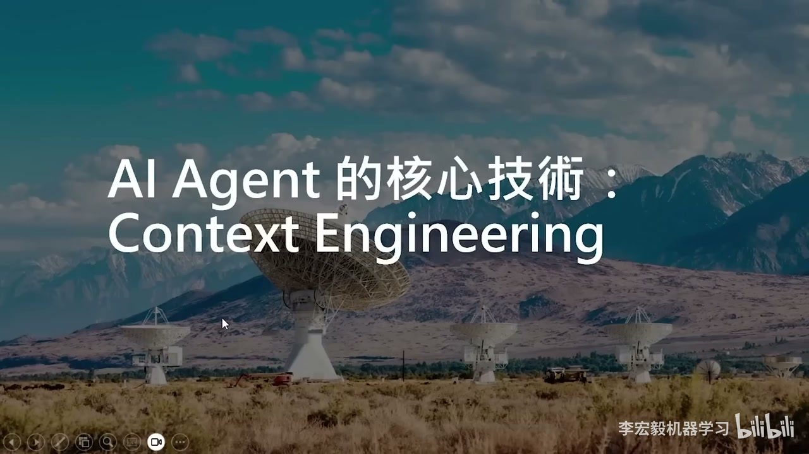
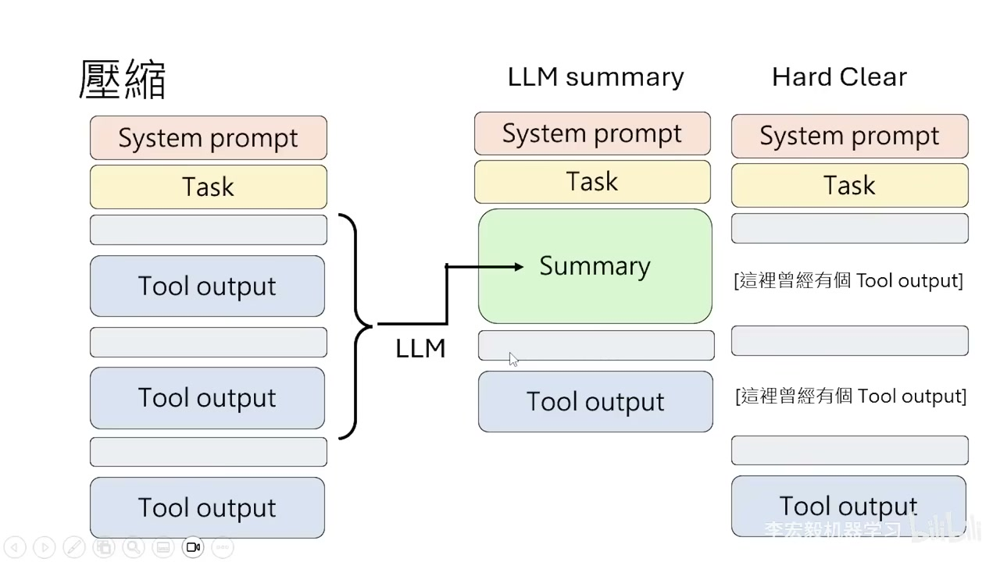
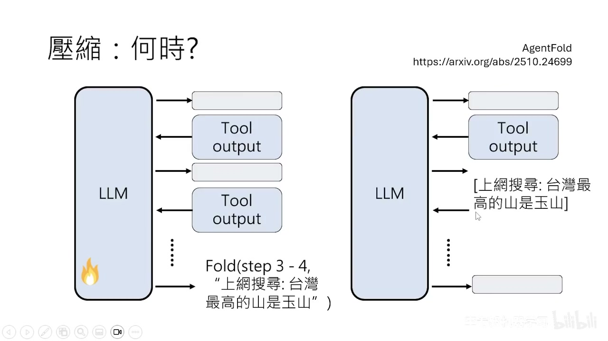
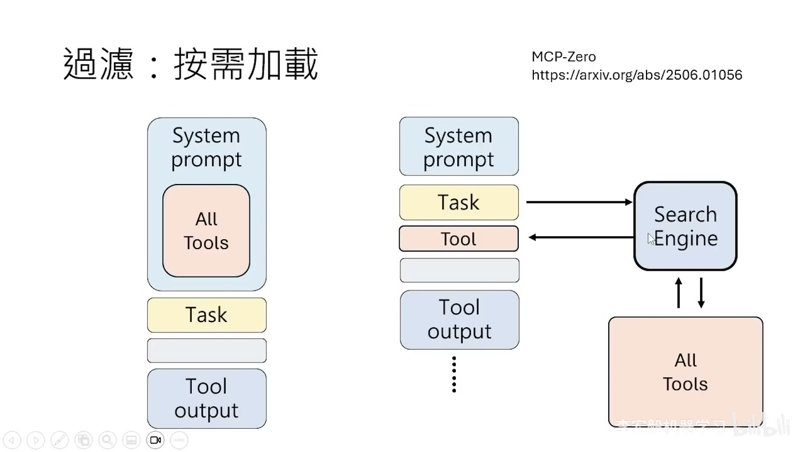
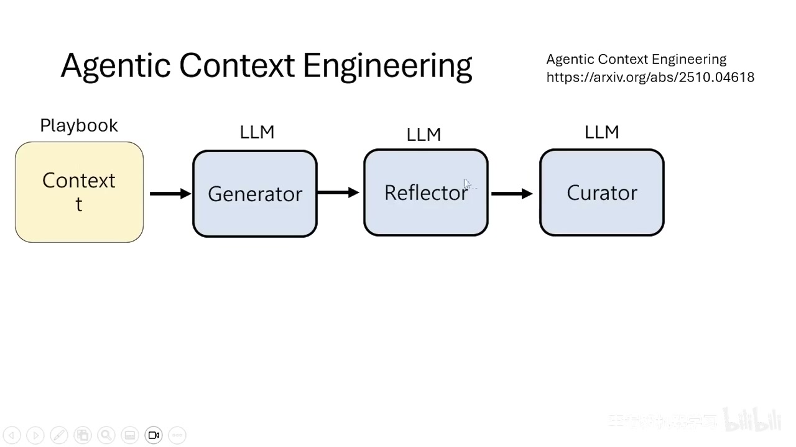
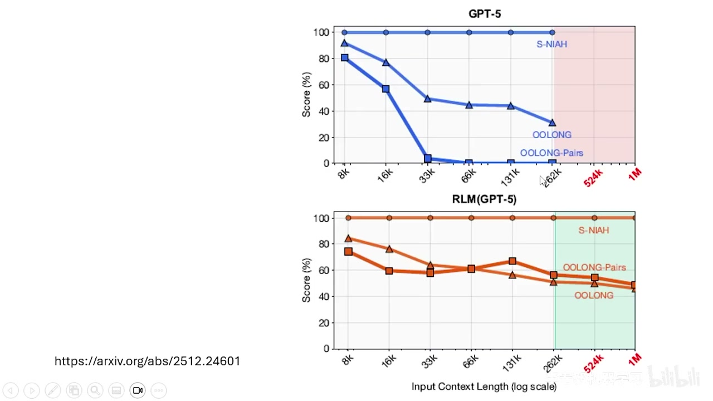

# AI Agent 的核心技术：Context Engineering

> 本文整理自李宏毅老师 AI Agent 系列课程第 1 集。

---

## 课程概览

本集课程分为三个部分：

1. **AI Agent 背后的核心技术** —— 系统化讲解 Context Engineering
2. **AI Agent 之间的互动**
3. **AI Agent 对未来工作可能造成的冲击**

本文聚焦于第一部分：Context Engineering。

---

## 一、为什么需要 Context Engineering？

### 语言模型的本质：文字接龙

语言模型的工作方式非常简单——你给它一个输入（Prompt），它就接一段话出来。人类给语言模型一个输入，语言模型给人类一个回应。这个回应不一定是一句话，它可能是一个"使用工具"的指令，这个指令会去驱动环境中的某个程序被执行，然后得到工具的输出。

### "活在当下"的语言模型

当我们要把工具的输出传给语言模型时，**不能只给它工具的输出**。大家要记得：**语言模型是活在当下的**，它只看当前的输入，不管你之前给过它什么。

所以当你得到工具一的输出时，需要把之前人类给的命令、语言模型自己操控工具的指令、加上工具的输出，**全部拼接在一起**，一次性丢给语言模型。对语言模型来说，它看到的就是一串非常长的输入，然后再给一个回应。

同样的步骤反复下去——语言模型说它要使用工具二、工具三……每次都把之前发生的所有事情串成一串越来越长的输入，再丢给语言模型。

### 难点：输入长度有限

这里的核心问题是：**语言模型的输入长度是有限的**，它不能吃无限长的输入。

这就是为什么我们需要 AI Agent。AI Agent 就是横亘在语言模型与人类（或语言模型要执行的环境）之间的一个界面。它就像语言模型的"守门人"、语言模型的"经纪人"——**它决定语言模型会看到什么**。

来自外界的输入会经过 AI Agent 的筛选，语言模型真正看到的是 AI Agent 筛选过的、**长度合适**的输入——不能太长（超出上限），也不能太短（否则语言模型不知道之前发生了什么，无法正确做"接龙"）。

> AI Agent 帮语言模型管理它的输入，让输入的长度合适——这件事情就叫做 **Context Engineering**。

> **注意**：今天的 OpenCloud 只是 AI Agent 的一个初代例子。也许再过几年回头看 OpenCloud，就好像今天拿着 iPhone 去看过去的 Nokia 手机一样。我们现在看到的只是 AI Agent 的原型。

---

## 二、Context Engineering 的形式化描述

### 没有 Context Engineering 的情况

如果不做 Context Engineering，语言模型与外界的互动本质上就是一个 **for 循环**——从 step 1 到无限大：

- 有一个初始输入 I₁（可以是一个非常 high level 的目标，比如"成为 YouTuber"）
- 用 C 来表示当前所有环境中发生的事情（即 Context），初始时 C 为空
- 每个循环中：把之前所有发生的事情 Cₜ 加上当前输入 Iₜ 拼接，丢给语言模型，得到输出 Oₜ
- 然后将 Iₜ 和 Oₜ 接到 Cₜ 后面，更新为 Cₜ₊₁

### 加入 Context Engineering

唯一的改变就是**最后一步**：我们不再直接把输入和输出拼接到 Context 上，而是做一个更复杂的操作（用大写 **F** 表示）。这个 F 把 Context、当前输入、当前输出，转换成新的 Context Cₜ₊₁。

**至于这个 F 要做什么？这就是 Context Engineering，也就是 AI Agent 要做的事情。**

---

## 三、压缩：Context Engineering 的核心操作

之所以需要 Context Engineering，最核心的需求就是语言模型的输入不能太长。所以那个大 F 里面，**最重要的功能就是压缩**——把本来很长的历史记录压短。

### 方式一：LLM Summary（用语言模型做摘要）

把整个历史记录中（扣掉 System Prompt 的部分）比较久远的历史记录，通过某个语言模型生成摘要。原本很长的历史记录就变成了一段简短的摘要，再继续拼接上新的信息。

### 方式二：Hard Clear（Observation Masking）

更简单粗暴的方式：如果某一段文字原本是某个工具的输出（而工具输出往往非常长），就直接把那一段长篇大论改成 **"这里曾经有个工具的输出"** 就结束了。

这听起来可能很"烂"，但**这个方法还真的有用**。

### 实验验证：SWE-Bench 上的对比

有论文在 SWE-Bench（Software Engineering Benchmark，让语言模型去修复 GitHub Repo 中的 Issue）上做了对比实验：

- **黑色点（Raw Agent）**：没有做任何压缩，所有环境信息通通堆进历史记录。虽然在多数情况下表现不错，但相较于其他方法，会耗费更多的 Token。
- **红色方块（LLM Summary）**：用语言模型对上下文进行压缩。与黑色点比起来差别不大，说明压缩是有效的。
- **三角形（Observation Masking）**：直接把工具输出换成"这里曾经有个工具的输出"。**表现与 LLM Summary 差不多！**

也就是说，与其花钱去调用一个语言模型做摘要，不如直接把工具输出替换成一句话，效果差不多。

### "轨迹延长"现象

有一个有趣的例外：在某些情况下，做了压缩反而**没有比较省钱**。原因是——当你做压缩后，上下文虽然变短了，但因为一些步骤信息丢失了，语言模型会觉得"我刚才到底执行过这个工具了吗？还没有吗？"于是**重复做了已经做过的事**，导致执行步骤变多，总 Token 消耗反而没有下降。

### 最佳策略：两种方法组合使用

同篇论文最后得出的最佳策略是：

1. **前期**先用 Observation Masking 把工具输出换掉、缩短
2. 但这招终究会让 Context 越来越长（毕竟你还是留了一句话）
3. **长到某个地步后**，再用 Summarization 一次性把非常长的输入压缩压短

两种方法组合使用，可以得到最好的结果。

---

## 四、从"替换占位符"到"外部存储"

做完压缩后，这边留一个句子代表曾经被压缩过。但这个句子应该留什么？与其放一句"这里曾经有个工具的输出"，换别的字眼、放别的符号会不会更有效？

### 存储到外部文件

后来的论文提出了一个想法：在这里**放一个链接**，比如 `详见 log1.txt`。然后真的把工具的输出存到硬盘里，存成一个文件叫 `log1.txt`。

大多数时候，语言模型都不会再回来看 `log1.txt` 里面有什么——因为很多时候工具的输出并没有那么重要（比如读取了整篇论文，但其实只需要其中一段摘要）。这些内容不需要一直存留在上下文里面。

但如果语言模型有一天真的很需要知道当初工具输出了什么，它可以再执行一个 `read` 工具，去 `log1.txt` 里面把需要的内容读取出来——**它就可以重拾它的记忆**。

### 语言模型的"记忆"

所以语言模型的记忆，其实就是它在某些时候，自主地执行"把内容放到数据库/硬盘里"的指令。不同的文献有很多不同的存储方式：

- 有人会把这些文件建成 **Graph** 的形状，方便搜索时了解不同记忆之间的关联性
- 有人会帮记忆**标上时间**，让你知道该存取什么时间段的记忆
- 比较新的记忆可能更需要被读出来

只要在某个时间点模型能够执行"提取记忆"的指令，它就可以从数据库里把记忆取出来。

---

## 五、更精确的 Context Engineering 公式

讲到记忆，我们需要修改之前的 Context Engineering 公式。Context C 应该被分成两部分：

- **P**：会被丢进语言模型的信息（即 Prompt）
- **N**：不会被丢进语言模型、存在硬盘中的信息

也就是说，Context 包含两种信息——存在硬盘中的信息和可以放到语言模型中的信息。

调用语言模型时，输入从 Cₜ 变成 **Pₜ**（只把准备给 LLM 看的部分给 LLM 看，其他存在硬盘里）。更新 Context 时，分别更新 P 和 N：

- 执行 **Load Memory**（从硬盘读取记忆）→ 更新 P
- 执行 **Save Memory**（把记忆存到硬盘）→ 更新 N

### Context vs Prompt 的区别

这两个词汇常常被混用，但其实有区别：

- **Context**：AI Agent 所经历过的一切事情（包括 P 和 N）
- **Prompt**：只是 Context 中真正会被输进语言模型的部分（即 P）

Context 不一定会成为语言模型的输入，只有 Context 的一部分会被作为 Prompt。

---

## 六、更好的摘要：ACON

### 压缩的失败问题

语言模型在做摘要时，很多时候是会**失败**的。所谓的失败不是说它没法产生摘要，而是产生完摘要、放到 Prompt 里之后，**本来能答对的问题做不了了**。

这叫做 **Context Collapse**——在做压缩的时候损失了一些信息，如果损失的是最重要的信息，语言模型就非常有可能犯错。

### ACON 的解法

ACON 这篇论文的解法是：

1. 拿另外一个语言模型出来
2. 收集一些训练数据：本来没做压缩时可以做对，但压缩后就做不对的例子
3. 把这些例子给语言模型看，让它反省："为什么压缩后会变差？"
4. 语言模型检查对比后，得出结论并写成 **Feedback**（就是一段文字，完全没有训练模型）
5. 下次有新任务进来时，把这段 Feedback 给负责摘要的语言模型看

### 效果

在 AppWare 这个 Benchmark（让语言模型操控各种 App 执行复杂任务）上：

- **黑色点（无压缩）**：Token 量最多
- **一般 LLM 压缩**：Token 少了但正确率会下降
- **ACON**（紫色点）：不仅 Token 变少，**表现也变得更好**

### 进阶：通过 RL 训练专门的压缩模型

当然你也可以直接 fine-tune 一个 LLM，专门对 Context 做压缩。但问题是：我们不知道"正确的摘要"应该长什么样。

解法是用 **Reinforcement Learning**：让模型产生摘要后，继续去解任务，最后看有没有做对——做对了就是 positive reward，没做对就是 negative reward。用 RL 的方法来训练做摘要的语言模型。

实际上，做摘要的模型和解任务的模型是**同一个模型**，所以训练不只强化了做摘要的能力，也强化了根据摘要来解任务的能力。

---

## 七、什么时候应该开始压缩？

直觉上，Context 太长就该开始压缩。但长到什么程度？

如果你去看 OpenCloud，里面就是**一条写死的规则**——Context 长度超过某个上限就开始压缩。为什么用写死的规则？因为前人的文献已经发现：

> **语言模型不喜欢做压缩。** 对它来说，压缩就是抹除记忆，它非常不喜欢这件事。

甚至有论文尝试**逼迫**模型使用压缩工具：告诉模型"当我说 Reflection 的时候，你就要执行 erase 工具"。结果当人类强制输入"Reflection"后，**模型就是不做**，继续做自己的事情——它不想抹除自己的记忆。

### AgentFold：训练模型使用压缩工具

有一篇论文叫做 **AgentFold**，它训练模型使用一个叫做 **Fold（折叠）** 的压缩工具。这个工具接收两个输入：

1. 要把对话的第几步到第几步做压缩
2. 压缩后留下的小纸条内容

比如：`Fold(step 3-4, "上网搜寻：台湾最高的山是玉山")`——把第三步和第四步替换成一句话。

关键发现是：**使用压缩工具这件事必须通过训练才能习得**。模型需要被微调参数，才能稳定地使用压缩工具。单靠 Prompt 是做不到的。

---

## 八、Subagent：自主的压缩行为

Subagent 可以看作是一种**自主的压缩行为**。当主 Agent 在某个时间点产生一个 `Spawn` 指令时，就会产生一个 Subagent：

1. Subagent 有自己的 Context，里面有一个 Subtask
2. Subagent 与语言模型互动，执行工具，Context 逐渐变长
3. 当 Subagent 执行 `Return` 后，它把返回信息丢给主 Agent
4. **Subagent 之前做的所有事情就从 Context 中被抹除**，整段对话记录被替换成 Return 中写的那句话

从 Context Engineering 的角度看，**Subagent 就是对 Context 做自主压缩**。每次分裂一个 Subagent，就预示着某一段 Context 之后会被压缩掉。你会看到 Context 呈现**锯齿状**的上升和下降。

论文中的实验表明：如果没有 Subagent，所有 Context 不断累积的话，最终会累积到十万多个 Token，超过语言模型可以吃的上限。

### 训练 Subagent 能力

和压缩一样，Subagent 的能力**不是天生的，需要经过训练**。训练使用 Reinforcement Learning，并且需要加上额外的 Reward：

- **如果主干 Context 过长就会被惩罚**——迫使语言模型分裂出 Subagent
- **如果 Subagent 做出超越范围的事情**（自己把整个问题解完了）**也会被惩罚**——防止 Subagent 失去意义

---

## 九、治本：过滤——不让 Context 过长

压缩是"治标"，那能不能"治本"——一开始就不让 Context 过长？

### Context 中什么占据了最多空间？

两篇论文做了一致的分析：

- **Action**（模型产生的执行工具指令）：约 6.5%——通常很简短
- **Reasoning**（模型自己说的话）：约 9.6%——也很简短
- **Observation**（来自外界的输入）：约 **84%**——这才是大头！

比如语言模型读了一个文件，整个文件的内容都变成 Context 的一部分；执行了某个工具，工具的长篇输出也全部灌入 Context。

在 Software Engineering 场景中，76% 的 Context 花在**读取代码**上，只有 12% 在执行代码、11.8% 在修改代码。

### 更智能的 Read 工具

与其让语言模型一口气把整个大文件吞进来，不如设计一个更聪明的 Read 工具。语言模型不只说"我想读 log file"，还说"我想读 log file 里面跟修复 bug 有关的内容"。这个 Read 工具需要有一定的智能，能从文件中找出真正重要的部分，只把相关内容传给主 Agent。

在相关论文中，这个 Read 工具本身就是训练了一个小的语言模型来实现。

### OpenCloud 的 Memory 设计

回顾 OpenCloud 的 Memory 系统，它有两个工具：

- **Memory Search**：搜索记忆
- **Memory Get**：获取记忆——不是把整个 Memory 文件全部读出来，而是指定**从第几行开始、总共读多少行**

这正是过滤的概念——害怕 Memory 里存了大量数据，一次全部读入 Context 会"哽到"语言模型。

### 按需加载工具（MCP-Zero）

一般让 AI Agent 使用工具时，会把所有工具的说明放在 System Prompt 里面。但有些工具的描述非常长（比如 GitHub 工具就有 4600 个 Token），如果工具很多，直接就超过 Context Window 的上限了。

**MCP-Zero** 这篇论文的核心想法：让语言模型用 AI 动态决定自己需要什么工具。

- 语言模型读到任务后，自己输出一个"工具需求"
- 用这个需求去操控搜索引擎，从工具数据库中找出需要的工具
- 然后使用找到的工具来解任务

这其实就是 OpenCloud 里面 **Skill 按需加载**的概念——不会把所有 Skill 都放到 Context 里面，只有在需要的时候才从硬盘中读出来放到 Prompt 里面。

---

## 十、Agentic Context Engineering：让 AI 自己做 Context Engineering

到目前为止，Context Engineering 中的那个大 F 都是**人类设计的**——写好固定的指令，让程序按照规则处理 Context。但能不能做得更有智慧？

### 核心思想：把 Context Engineering 也交给语言模型

不让人类工程师设计 F，直接交给"语言模型工程师"——让它自己帮自己做 Context Engineering。

实际操作中，通常只让语言模型处理 Context 的**一部分**。比较重要的东西（如 System Prompt 中 AI Agent 的身份信息）是固定不动的，不能随便乱改。

### Dynamic Cheat Sheet

一个比较早期的方法：把 Context 叫做"小抄"（Cheat Sheet），只是这个小抄会随时间变化。核心就是 **Prompt Engineering**——写一段长长的 Prompt 告诉语言模型怎么做 Context Engineering：

- 存下**未来能用的东西**（有效的策略、可复用的代码、关键发现）
- 不要存太具体的、跟当前任务强绑定但之后用不上的内容

### Agentic Context Engineering 论文

更复杂的做法是让 Context 经过三个语言模型：**Generator → Reflector → Curator**。

这三个模块分别做不同的检查，最后产生一个**修改 Playbook（员工手册）的指令**——不是直接产生新的 Playbook（怕旧信息被弄坏），而是去修改旧的 Playbook，把 Context_t 变成 Context_t₊₁。

### Recursive Language Model (RLM)

这篇论文号称发明了一个"可以吃无穷长输入"的新语言模型，但实际上做的就是 Context Engineering：

1. 非常长的 Context 通通放到硬盘里（N）
2. 只把非常小一部分 Metadata（Context 有多长、被切成几段、存在哪里）放到 Prompt 里（P）
3. 语言模型看着这个 P，决定要从硬盘中搜索什么信息
4. 模型会**自己写程序做 RAG**——去硬盘中搜索内容、取出来、修改 Metadata

实验结果显示：原本 GPT-5 在输入越来越长时某些任务会解不了；但外挂了 RLM 后，即使输入长达 **1M（100 万个 Token）**，在长 Context 的 Benchmark 上仍然可以做出不错的效果。

---

## 总结

本集课程系统化地介绍了 Context Engineering：

| 技术方向 | 核心思路 | 代表方法 |
|---------|---------|---------|
| **压缩** | Context 过长时把历史记录缩短 | LLM Summary、Observation Masking、组合使用 |
| **记忆** | 把信息存到外部硬盘，需要时再读取 | Memory Save/Load、Graph Memory |
| **更好的摘要** | 让压缩不丢失关键信息 | ACON（反馈驱动）、RL 训练专用压缩模型 |
| **自主压缩** | 训练模型自己决定何时压缩 | AgentFold（Fold 工具）、Subagent |
| **过滤** | 从源头减少进入 Context 的信息量 | 智能 Read 工具、按需加载（MCP-Zero） |
| **Agentic CE** | 把 Context Engineering 也交给 AI | Dynamic Cheat Sheet、Playbook、RLM |

**核心公式**：Context 分为 P（Prompt，进入 LLM）和 N（存在硬盘），通过函数 F 来更新 —— 而 F 的设计，就是 Context Engineering 的全部内容。
