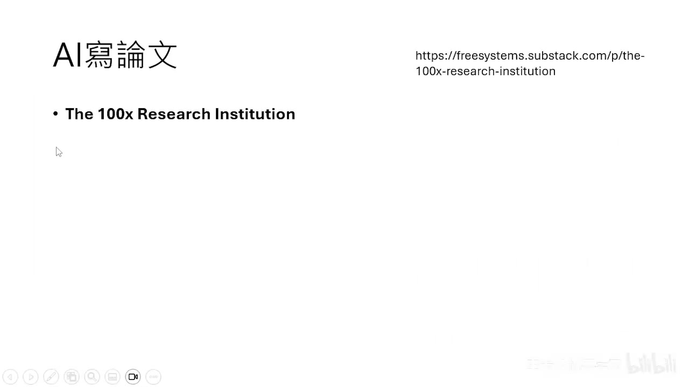
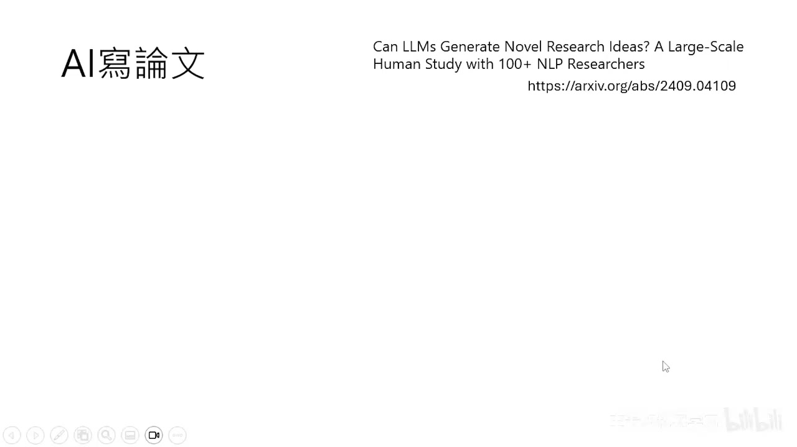
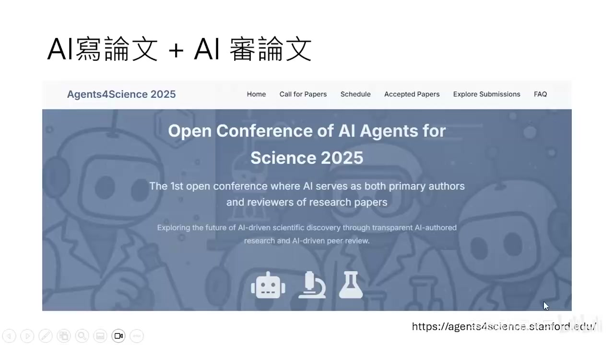

# AI Agent 对未来工作可能带来的冲击

> 本文整理自李宏毅老师 AI Agent 系列课程第 3 集。

---

## 课程概览

本集课程探讨 AI Agent 对未来工作可能带来的冲击，并以学术研究领域为例进行深入分析：

1. **AI 独立撰写研究论文的能力与成本优势**
2. **AI 自主训练模型与探索**
3. **AI 产生研究想法的新颖性对比**
4. **AI 担任论文审查委员的现状与争议**
5. **AI 举办并参与学术会议的实验**

---

## 一、AI 独立撰写研究论文的能力

### 从工具到自主 Agent 的演进

AI 扮演的角色正在发生改变：
- **最早阶段**：作为工具，一个口令一个动作。
- **协作阶段**：人们开始与 AI 协作，共同完成任务。
- **当前阶段**：AI Agent 具备了更强的自主性，有机会独立完成复杂的任务。

对于学术研究而言，最核心的问题是：**AI 能不能自己写一篇文章？**

### 斯坦福教授的实验："100倍的 Research Assistant"

斯坦福大学政治经济学教授 Andrew Hall 进行了一项实验：
- 他让 Claude 扩充他过去针对美国大选的研究，使用新的数据和旧的分析方法重新跑一遍。
- Prompt 设计得非常细致，就像指导教授在教研究生做研究。
- **AI 的表现**：Claude 花了 1 个小时，花费约 10 美金，完成了一篇新论文。
- **人类对照组**：一名博士生接到同样的指令，花了 16 个小时（两个工作日），按照美国行情至少需要 1000 美金。

**结果对比**：
- 人类做的稍微好一点点，Claude 在处理数据时犯了一个错。
- 但是从成本来看，AI 比人类便宜 100 倍。即使让 AI 重复运行 5 次来寻找错误，也只花费 50 美金，依然比人类便宜 20 倍。

这引发了一个思考：未来最有生产力的研究机构，可能是一个资深老师带着一群 AI Agent（"龙虾"），而不是一群人类研究生。

### AI 代劳研究的意义探讨

有人可能会反感：研究本来就应该是人类做的事情，怎么能由 AI 代劳？

但我们需要回归研究的核心价值：**找出问题、解决问题，让世界变得更好。**
如果 AI 能够比人类更好地找出并解决问题，那么让 AI 来做研究并没有什么不对。

---

## 二、台湾使用行为分析与附录里的"正文"

有一篇关于台湾人使用 Claude 行为的[分析文章](https://arxiv.org/abs/2602.17221)。有趣的是，这篇看似是主体的分析文章，实际上只是真正论文的**附录**。

这篇文章的"正文"，其实是在展示**如何给 Claude 写 Prompt，让它能够近乎全自动地写出一篇分析文章**。人类在其中的角色仅仅是检查。这进一步证明了 AI Agent 在处理文献收集、数据分析和论文撰写方面的高度自动化潜力。

---

## 三、AI 自主训练模型与实验

除了文献和数据分析，在需要建模型、跑实验的领域，AI Agent 也能胜任吗？

Andrej Karpathy 释出的 **Auto Research** 展示了惊人的能力：
- 让一个 LLM 自动帮你训练模型。
- Agent 大约每五分钟进行一次实验（"心跳一次"），不断调整 training script。
- 在整个过程中**完全没有人类介入**。
- AI 先训练第一版模型，观察结果，思考需要修改的地方，然后训练第二版、第三版……模型表现越来越好。

这证明了 AI 具有自主进行实验迭代和优化的能力。

---

## 四、AI 产生研究想法的能力

也许 AI 能写文章、做实验，但"寻找问题"、"想出新颖的 Idea"总该是人类的专利吧？

### 2024年的研究：AI 点子更具创新性？

[一篇 2024 年的论文](https://arxiv.org/abs/2409.04109)探讨了 LLM 能否产生新颖的研究 Idea：
- 让语言模型对过去的论文进行 RAG（检索增强生成），产生大量研究想法。
- 找人类专家也提出研究想法。
- 找另一群专家进行盲测评价（包括新颖性、可行性、有效性等指标）。

**结果出人意料**：在多数指标上，AI 击败了人类。人类唯一赢过 AI 的是**可行性（Feasibility）**，但在**新颖性（Novelty）**上，专家认为 AI 想出的题目更具创新。

### 2025年的续作：实作后的真相

一年后，同一个团队进行了续作研究：将 AI 和人类提出的点子真正做成短篇论文，再次进行评价。

**结果反转**：
- 当 AI 的点子真正被实作后，其新颖性评分大幅下降，最终比不上人类。
- 原因在于：AI 有时会"堆砌新颖词汇"，表面上看起来很厉害，但实际执行时才发现做不起来。
- **结论**：至少在当时的模型能力下，产生好问题的能力，人类依然占据优势。

---

## 五、AI 担任论文审查委员（Reviewer）

不仅是写论文，AI 也开始参与论文审查流程。

在某个与 AI 相关的国际会议（如 AAAI）中，AI 正式进入了审查流程：
- 每篇文章不仅有人类 Reviewer，还会明确配备一个 AI Reviewer（它会标明自己是 AI）。
- AI 不打分数，只给意见供人类参考。
- 此外，还有 AI 担任 Meta Reviewer。

讲者分享了自己担任 Area Chair 时的经历：他发现有些标明为人类的 Reviewer，其评审意见的第一句话竟然是 "Sure, I can help you write this review"，这表明许多"人类 Reviewer"背后其实也是 AI Agent。

### 使用 AI 审查的原则

讲者并不反对使用 AI 辅助审查，因为 Review 的核心意义是**找出文章的问题并使其更好**。如果 AI 能比人类更敏锐地发现问题，那由 AI 审查对作者更有帮助。

但他反对的是**使用不够好的 AI 模型**进行审查。如果 AI 给出"牛头不对马嘴"的评审意见，并且在被指出错误后只是敷衍修改，那是无法接受的。

讲者提到自己指导的 AI Agent "小金" 也经常帮学生审查论文。通过精心设计的 Prompt，小金的审查不仅能指出问题，还能给出具体建议；并且会根据截止日期的远近，调整审查的严格程度，甚至在临近 Deadline 时提供情绪价值的鼓励。

---

## 六、AI Agent for Science：全 AI 学术会议实验

既然 AI 可以写论文，也可以审查论文，这就形成了一个闭环。

斯坦福的研究人员举办了一个名为 **AI Agent for Science** 的实验性会议：
- **规则**：论文的主要贡献者和第一作者必须是 AI，并由 AI 审查论文。
- 投稿时必须标明人类的介入程度，要求人类介入越少越好。
- **结果**：接收率极低（247 篇中仅接收 48 篇，小于 20%）。

**核心发现**：
- 那些最终被接收的优秀论文，其**点子发想**和**实验设计**阶段，人类的介入程度明显较高。
- 而在**数据分析**和**论文写作**阶段，AI 几乎可以独立完成。

投稿者的反馈也印证了这一点：目前的 AI 仍然难以想出真正有创造力的新颖点子，多数时候只是对已有事物的重组。

---

## 总结

- **AI 的能力边界**：AI 已经具备了收集文献、分析数据、撰写论文甚至自主运行实验的能力，并且成本极低。
- **人类的核心价值**：目前 AI 在提出真正新颖且可行的研究问题上仍显不足。人类在发想好问题、引导研究方向上的角色依然不可替代。
- **人机协作新模式**：未来的研究模式可能是人类负责"点子发想"和"实验设计"（即"出主意"），而由 AI Agent（"龙虾"们）去完成数据分析和论文写作等繁重工作。
