# AI Agent 的核心技术：Context Engineering

> 本文整理自李宏毅老师 AI Agent 系列课程第 4 集（Context Engineering 深入探讨）。

---

## 课程概览

本集课程探讨在 AI Agent 时代，让 Agent 成功运行的关键技术——**Context Engineering**。课程大纲如下：
1. **Context Engineering 的概念与演进**
2. **一个完整的 Context 应该包含什么？**
3. **运行 AI Agent 的挑战：过长的上下文**
4. **Context Engineering 的三大套路：选择、压缩、Multi-Agent**

---

## 一、Context Engineering 的概念与演进

### 什么是 Context Engineering？
语言模型本质上是在做“文字接龙”（根据输入 $X$ 预测输出 $f(X)$）。如果结果不如预期，我们有两个方向可以调整：
- **改变模型本身（参数）**：这就是“训练”（Training / Learning）。
- **改变输入（Prompt/Context）**：对于多数闭源大模型，我们无法改变其参数，只能通过给出更合适的输入来引导其输出。

在这堂课中，**没有任何模型被训练，我们只“训练”人类**，学习如何提供更好的上下文。

### Context Engineering vs. Prompt Engineering
这两个词本质上指涉相同的概念——把语言模型的输入弄好。但它们关注的重点随时代发生了变化：

- **Prompt Engineering 时代**：
  在早期（如 GPT-3 时代），语言模型能力较弱，人们热衷于寻找**“神奇咒语”**来提升模型表现。
  - 示例 1：在 prompt 后面加上一连串毫无意义的 "Waves waves waves"，竟然能让 GPT-3 的输出变长（出自论文：[Learning to Generate Prompts for Dialogue Generation through Reinforcement Learning](https://arxiv.org/abs/2206.03931)）。
  - 示例 2：加入 "Let's think step by step"（一步步思考）来提升数学推理能力（出自论文：[Large Language Models are Zero-Shot Reasoners](https://arxiv.org/abs/2205.11916)）。
  - 其他咒语：深呼吸、给你小费、关系到世界和平等。
  
  但随着模型能力增强，它们本就该“使尽全力”做到最好，神奇咒语的加成效果越来越低。

- **Context Engineering 时代**：
  现在人们关注的是：如何**自动化地管理语言模型的输入**。特别是当 AI Agent 需要多步运行、自主调用工具时，如何保持其上下文的高效与整洁。

---

## 二、一个完整的 Context 应该包含什么？

现代语言模型的输入（Context）不再只是一两句简单的问句，它通常极其庞大，包含以下几类信息：

### 1. User Prompt (使用者的指令)
不仅包含任务目标，还要包含**详细的限制条件和背景情境**。
- **背景情境的影响**：同样问“水中是什么动物”，如果补充“这是在曼谷运河拍的”，模型就能准确判断那是“水巨蜥”而不是“鳄鱼”。
- **范例 (In-Context Learning)**：提供少量的输入输出范例，能极大提升模型对特定格式或陌生任务的理解力。
  - 例如 Gemini 1.5 的技术报告中，仅通过在 Context 中放入一本极其冷门的卡拉芒语（Kalamang）教科书，模型就能获得翻译卡拉芒语的能力。这完全是靠上下文实现的“学习”，模型参数并未改变。

### 2. System Prompt (系统提示词)
开发平台为模型预设的行为准则。

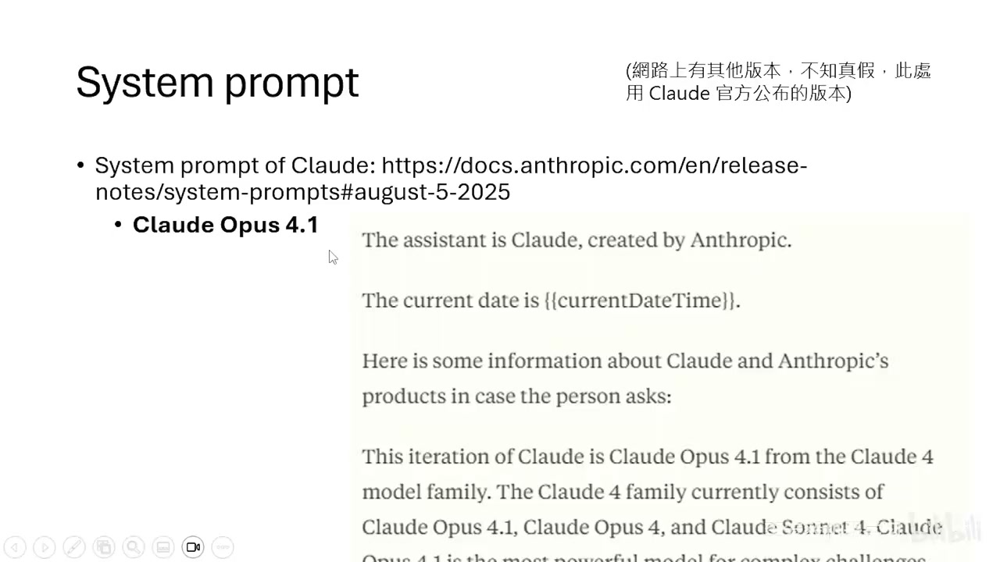

以 Claude Opus 4.1 为例，它的 System Prompt 长达 2500 字，其中规定了：
- 它是谁、今天是几月几号（解答了“模型为什么知道日期”的疑惑）。
- 不要教人制造核武或合成毒药。
- 回答时不要老是用 "Good question" 开头。
- 如果被人类纠正，不要马上承认错误，要仔细思考（因为现代大模型太容易无脑附和人类）。

### 3. 记忆与外部资讯
- **对话历史记录（短期记忆）**：同一对话窗口中的内容。
- **长期记忆**：如 ChatGPT 的 Memory 功能，它会在背景中根据过去的对话自动生成摘要记录。
- **外部搜索资讯 (RAG)**：通过搜索引擎获取最新信息，加入上下文中以弥补模型知识的滞后。

### 4. 工具使用 (Tool Use) 的说明与输出
如果要让模型使用工具，必须把“工具说明书”塞进 Context 中。

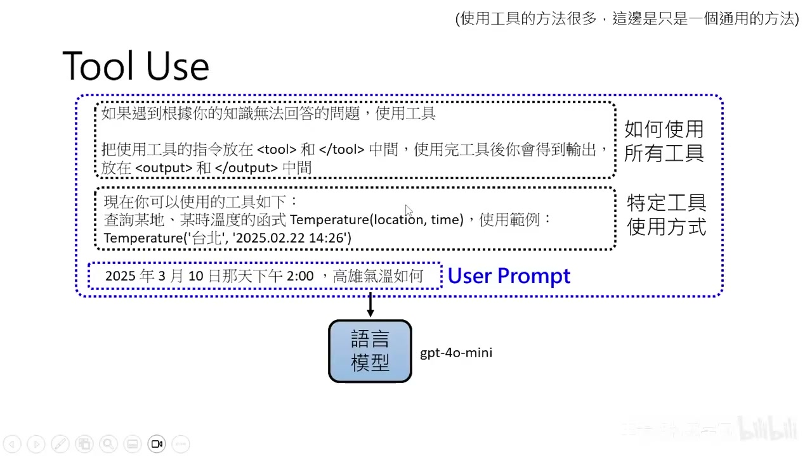

**模型是如何使用工具的？**
1. 告知模型可用工具的格式（如放在 `<tool>` 和 `</tool>` 之间）。
2. 模型进行文字接龙，生成了一段调用工具的文本。
3. **关键点**：文字本身不会执行工具。需要一个外部的小程序（如 Python 中的 `eval()` 函式），将这段文字提取出来执行。
4. 将工具返回的结果放到 Context 中。
5. 模型再根据工具的结果继续接龙出最终答案给使用者。

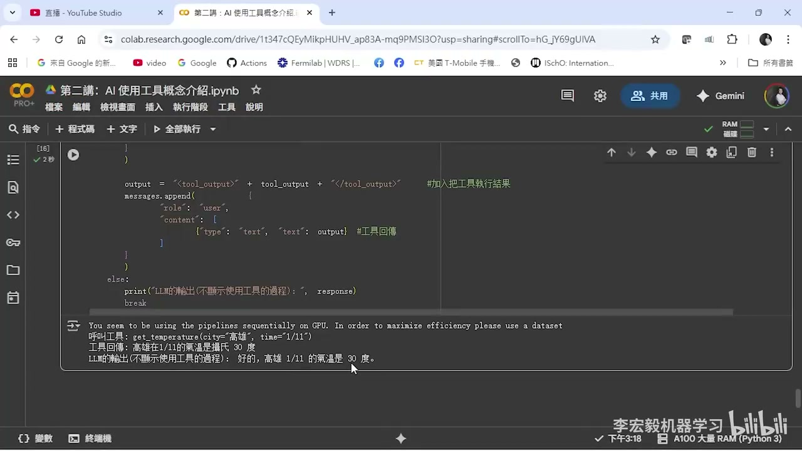

**更强大的工具：Computer Use**
像 Claude 或 ChatGPT 代理模式，可以通过截取屏幕画面作为观察（Observation），然后输出移动鼠标或敲击键盘的坐标和指令，实现像人类一样订高铁票或浏览网页。

### 5. 模型自己的思考过程 (Reasoning)
如 OpenAI 的 o1 或 DeepSeek-R1，它们在给出答案前，会在脑内演练“小剧场”（提出假设、自我验证、修改路线）。这些思考过程也是其 Context 的一部分。

---

## 三、运行 AI Agent 的挑战：输入过长

AI Agent 是一个在**环境**中不断循环的智能体：
> 观察 (Observation) -> 行动 (Action) -> 环境改变 -> 新的观察 -> ...

由于 Agent 需要长时间运行，其互动的历史记录会越来越长。

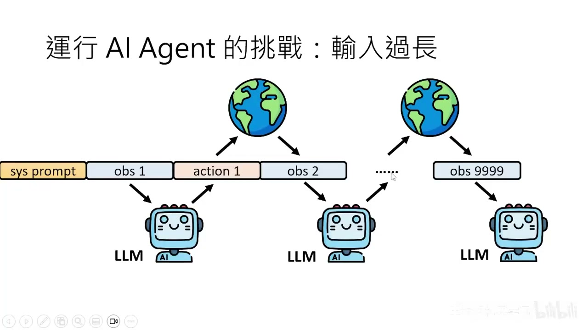

虽然现在模型的 Context Window 越来越长（GPT-4 支持 3 万 token，Claude 支持 10 万，Gemini 支持百万，Llama-4 甚至达到千万 token），但这并不意味着“把所有东西都塞给模型”就万事大吉了。

**过长的上下文会导致灾难：**

1. **Lost in the Middle (中间迷失)**：
   研究表明（[Lost in the Middle](https://arxiv.org/abs/2307.03172)），模型通常只记得上下文的开头和结尾。如果关键答案藏在长文档的中间，模型的正确率会断崖式下降。

2. **多轮对话中的迷失**：
   有论文（[LLMs Get Lost In Multi-Turn Conversation](https://arxiv.org/abs/2505.06120)）发现，将一个复杂问题拆解为多个子步骤进行“挤牙膏式”的交互，模型的表现反而比一次性把需求说清楚更差、更不稳定。

3. **Context Rot (上下文腐烂)**：
   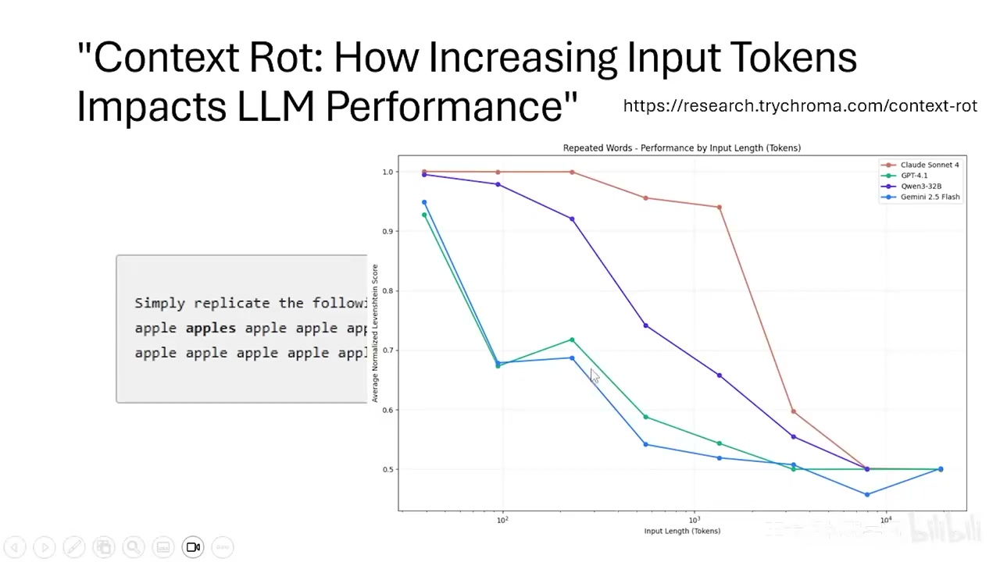
   即使是最简单的“复读机”任务，当输入长度达到数万 token 时，那些号称支持百万级窗口的模型也会开始胡言乱语（[Recursive Language Models](https://arxiv.org/abs/2512.24601)）。模型面对过长文本时，会产生严重的困惑。

**结论**：Context Engineering 的核心目标就是一句话——**避免塞爆 Context，只放需要的，清掉不需要的。**

---

## 四、Context Engineering 的三大基本套路

### 1. 挑选 (Selection)

不要把所有的资讯都丢给模型，而是利用 RAG 等技术精准挑选。

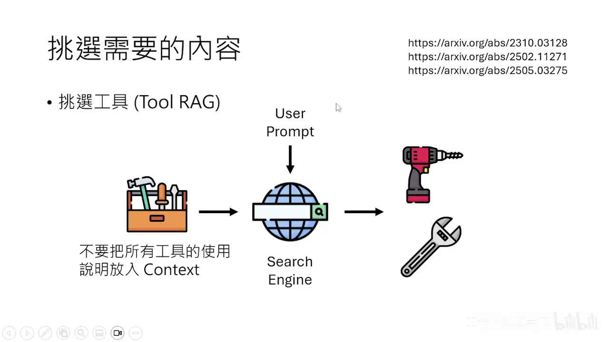

- **挑选文章与句子**：先用搜索引擎搜文章，再用一个跑得极快的小模型（如 [Provence 论文](https://arxiv.org/abs/2501.16214) 提出的方案）挑选出真正相关的句子，最后才喂给大模型。

  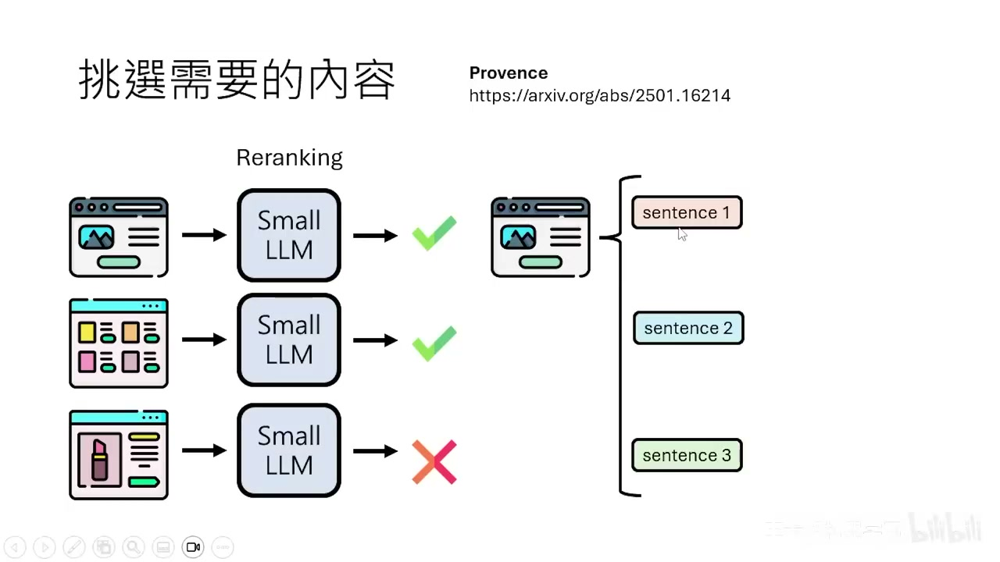
- **挑选工具 (Tool RAG)**：不要把几千个工具的说明书全塞给模型，根据用户的当前需求，只检索相关的 3~5 个工具放入 Context 中。
- **挑选记忆 (Memory RAG)**：
  在早期的[斯坦福虚拟小镇 (Generative Agents)](https://arxiv.org/abs/2304.03442)中，Agent 的记忆是极其琐碎的（如“看到一张床”）。系统通过给记忆打分（根据近期程度、重要性、相关性），只提取最高分的记忆给大模型。

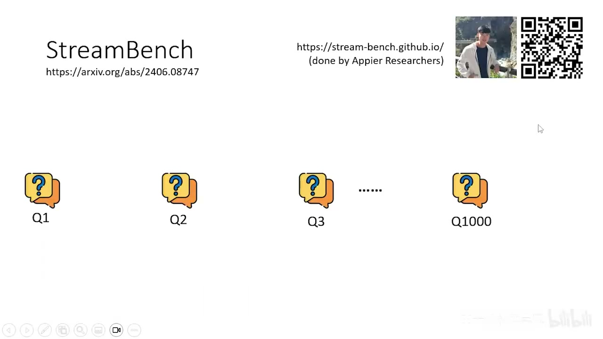
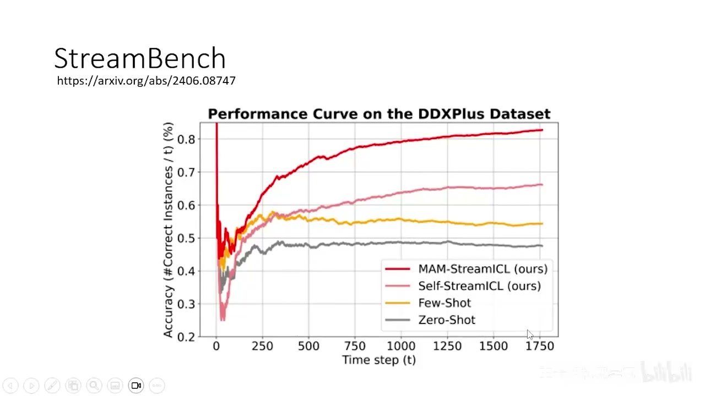

- **挑选历史经验的诡异现象**：
  在评估 Agent 持续改进能力的 [StreamBench](https://arxiv.org/abs/2406.08747) 实验中，研究者发现：**如果把模型过去“答错”的经验放进 Context 试图让它避免重蹈覆辙，模型的表现反而会显著下降！** 就像对人说“不要想白熊”，他反而满脑子都是白熊。目前而言，只给模型提供成功的经验效果最好。

### 2. 压缩 (Compression)

当互动记录太长，又不想让模型失忆时，可以使用一个专门的模型对历史记录进行摘要。

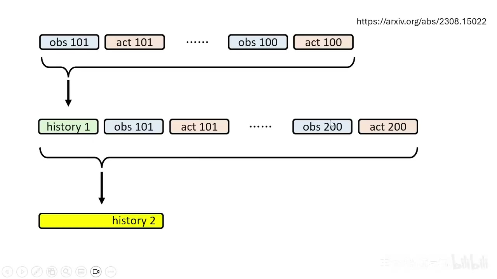

- **递回式压缩**：每互动 100 轮，就将这 100 轮的内容与上一次的摘要进行合并，生成新的摘要（[Recursively Summarizing Enables Long-Term Dialogue Memory](https://arxiv.org/abs/2308.15022)）。太久远的细节会慢慢被遗忘，只留下大纲。
- **对于 Computer Use 尤为重要**：模型与网页互动的过程中充满了“鼠标移至此处、关闭弹窗广告、点击下拉菜单”等垃圾信息。这几百步的操作完全可以被压缩成一句话：“已成功预定 A 餐厅，9 月 19 日下午 6 点，10 人”。

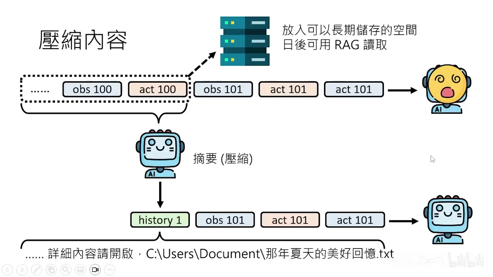

- **防范摘要丢失细节的技巧**：如果不放心摘要会丢掉关键细节，可以把原始细节保存到硬盘（txt 文本）中。在摘要里留下一句话：“想要回忆那年夏天的详细故事，请打开 `xxx.txt` 档案”。这就为模型提供了一条随时读取细节的索引路径。

### 3. 多智能体协作 (Multi-Agent)

将大任务拆分给多个 Agent 共同完成。

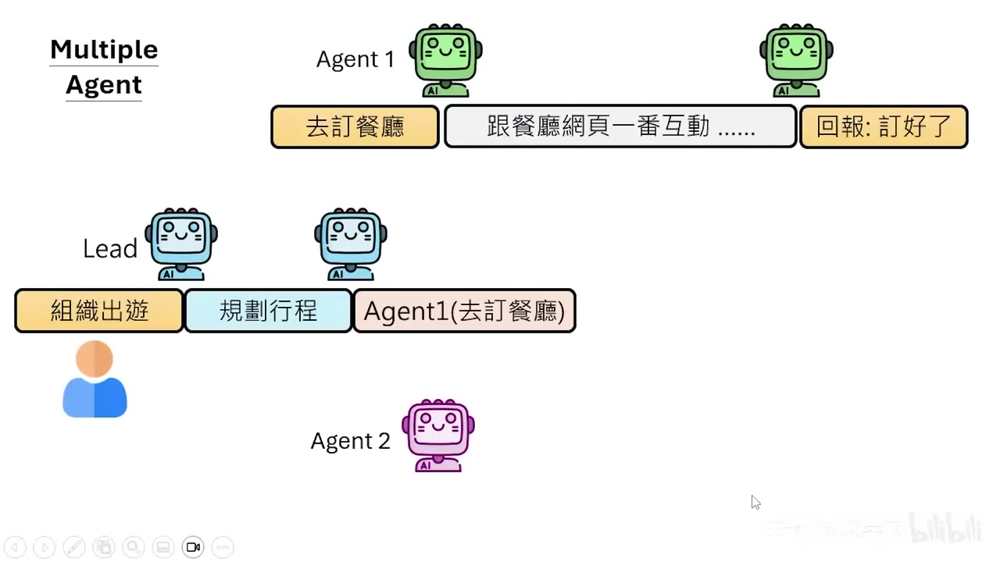

从 Context Engineering 的角度来看，Multi-Agent 其实是一种**卓越的上下文隔离手段**：
- 假设由一个“主 Agent（总召）”负责制定旅行计划。
- 它不需要亲自去订餐厅和酒店，而是把“订餐厅”的任务派发给 Agent 1，把“订酒店”的任务派发给 Agent 2。
- Agent 1 在订餐厅过程中产生的所有繁琐的网页交互 Context，全都在它自己的窗口里，**不会污染**主 Agent 的 Context。
- 最终主 Agent 得到的 Context 非常清爽：“餐厅已定好”、“酒店已定好”。

同样，当需要撰写一篇涉及 100 篇论文的 Review 文章时，让一个 Agent 读 100 篇论文肯定会塞爆。但如果派 100 个 Agent 各自读 1 篇并写出摘要，再交给主 Agent 统整，就能完美避开上下文瓶颈。

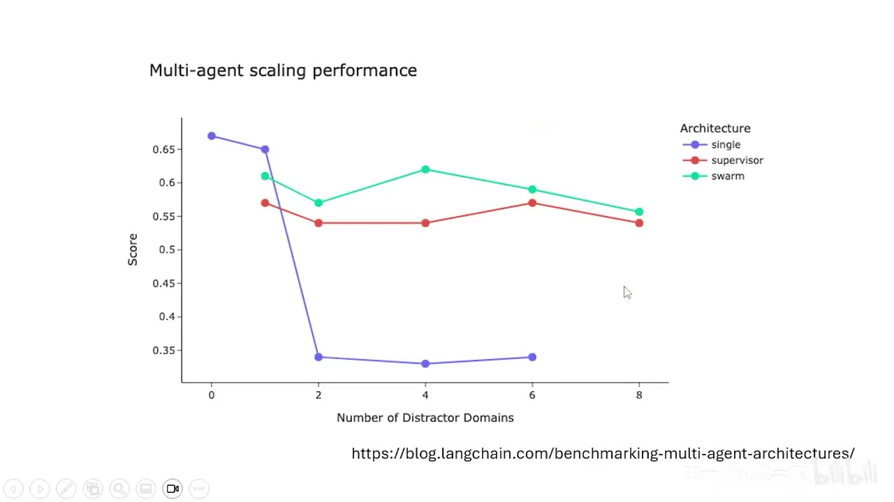

根据 LangChain 等框架的测试，在简单任务上，Single Agent 可能更快更好；但面对高度复杂的任务，Multi-Agent 架构展现出了压倒性的优势。

---

## 总结

- **Context Engineering** 不是什么神奇的“新玄学”，它是管理 AI Agent 大脑缓存的一门务实科学。
- 不要盲目迷信超大上下文窗口模型。即便它们“装得下”，它们也“读不懂”、“记不清”。
- 熟练运用**挑选相关资讯（RAG）、压缩无关废话（摘要）、利用团队分工（Multi-Agent隔离）**，才能让你的 AI Agent 稳定、持久、聪明地运行。